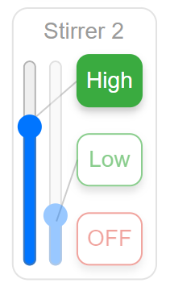

Problems and Solutions
======================

* Sometimes the OD spontaneously becomes very noisy. This can be a problem with the stirring speed - if it is too high, the magnet detaches and jumps into the laser path. Lower the high stirring speed setting to fix this. This can happen if the stirrer motor warms up during operation and the optimum calibration settings shift slightly.

.. image:: pics/od_noise.png
   :height: 200px
   :align: left

